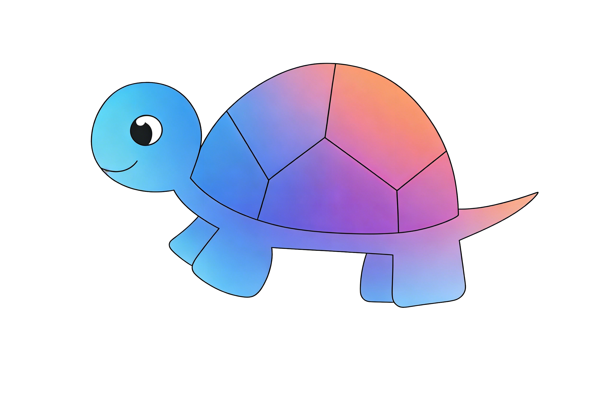

#  小乌龟信息图 (Turtle Infographic)

> **基于 Gemini API 的智能信息图生成工具**
>
> 🚀 **只需四步**：选风格 → 选比例 → 输内容 → 生成图片

---

## ✨ 功能特点 (Features)

*   🎨 **8 大风格分类**：
    *   🧊 **3D拟真**：立体感强、真实感高的3D风格
    *   🔳 **极简扁平**：简洁明了、现代感强的设计
    *   🦾 **科技赛博**：未来感、霓虹光效
    *   🕰️ **复古怀旧**：经典复古色调与纹理
    *   🌿 **艺术有机**：自然元素、手绘质感
    *   🎬 **电影视觉**：高对比度、氛围营造
    *   🧱 **材质纹理**：强调材质细节
    *   🌀 **抽象概念**：几何图形与色彩块

*   📐 **多种比例预设**：
    *   `1:1` (Square)：社交媒体、头像
    *   `4:3` (Standard)：演示文稿
    *   `16:9` (Widescreen)：视频封面
    *   `3:4` (Portrait)：手机壁纸

*   🤖 **智能提示词生成**：自动将简单描述转化为结构化的高质量提示词。
*   🖥️ **图形用户界面**：直观友好的 GUI 操作体验。
*   ⚙️ **灵活配置**：支持自定义 API 密钥、保存路径等。
*   🌐 **多模型支持**：完美支持 Gemini 系列及 OpenAI 格式 API。

---

## 📂 项目结构 (Structure)

```text
Turtle-Infographic/
├── 🐢 turtle.png            # Logo 图标
├── ⚙️ config/               # 配置模块
│   ├── config.json.example  # 配置模板
│   └── config.json          # 您的配置文件
├── 🧠 core/                 # 核心逻辑
│   ├── prompt_generator.py  # 提示词引擎
│   └── image_generator.py   # 图片生成引擎
├── 🖥️ interface/            # 界面模块
│   └── gui.py               # GUI 主程序
├── 🖼️ output/               # 输出目录
│   └── infographics/        # 生成结果
├── 🚀 main.py               # 启动入口
├── 📦 requirements.txt      # 依赖清单
└── 📄 README.md             # 说明文档
```

---

## 🛠️ 环境要求 (Requirements)

*   🐍 **Python 3.8+**
*   💻 **Windows / Linux / macOS**
*   🌐 **网络连接** (用于访问 Gemini API)

---

## 🚀 快速开始 (Quick Start)

### 1. 克隆项目

```bash
git clone https://github.com/frank36512/turtle-infographic.git
cd turtle-infographic
```

### 2. 安装依赖

```bash
pip install -r requirements.txt
```

> 📦 **核心依赖**：`requests` (网络请求), `Pillow` (图片处理), `tkinter` (内置 GUI 库)

### 3. 配置 API

前往 [Google AI Studio](https://aistudio.google.com/app/apikey) 获取您的 **Gemini API Key**。

**方式 A：界面配置 (推荐)**
直接运行程序，在"系统设置"中输入 Key 并保存。

**方式 B：手动配置**
复制 `config/config.json.example` 为 `config/config.json`，并填入 Key：

```json
{
  "gemini_api_key": "YOUR_GEMINI_API_KEY_HERE"
}
```

### 4. 启动程序

```bash
python main.py
```

---

## 📖 使用指南 (Usage)

1.  🔑 **设置**：首次运行配置 API Key。
2.  🎨 **风格**：下拉选择心仪的设计风格。
3.  📐 **比例**：设定输出图片的尺寸比例。
4.  ✍️ **内容**：输入您的创意或主题描述。
5.  ⚡ **生成**：点击生成按钮，稍候片刻。
6.  💾 **保存**：预览满意后，结果自动保存至 `output/`。

---

## 📄 开源协议 (License)

本项目采用 [Apache License 2.0](LICENSE) 协议开源。

Copyright © 2024 Turtle Infographic Contributors.
